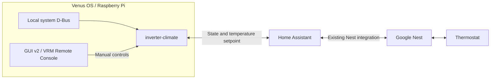

# inverter-climate

Energy-aware climate coordination **on Venus OS**, using local **D-Bus** and
**Home Assistant**. Google Nest remains connected through Home Assistant's
existing integration; this package needs no Google credentials or additional
Google project. A small supervised Python process runs beside the existing
Venus services, including on Raspberry Pi 3. It reads system energy over D-Bus
and exposes optional native thermostat controls.

The first use case is a gas furnace that consumes approximately **500 W of
electricity while heating**. Gas supplies the heat; electricity runs the furnace
and associated equipment. This service can shift useful heating toward measured
solar export. It does **not** measure gas usage, guarantee financial savings, or
create a reason to burn additional gas just to consume electricity.

**Observation mode is the default.** Automatic preheating only writes when
`mode = "active"`. Separately, `[device] control_enabled = true` enables explicit
user commands from the native Switch pane. Both forms of control are disabled
by default; enabling manual controls does not enable automatic preheating.

## Connections



The native installation needs neither Kubernetes, Docker, inverter-gateway,
Cloudflare Access nor Node-RED. Network requests run in this separate low-rate
process, outside the inverter-control loop. HA still provides the Nest cloud
connection. This third-party Venus OS package publishes a temperature device in Remote
Console; HA owns the Nest protocol and authentication.

## Native Venus OS installation

Install through SetupHelper/PackageManager: package **inverter-climate**, GitHub
user **victron-venus**, branch **latest**. This branch contains the verified
stable package with its locked pure-Python dependencies. The development `main`
branch is source code. Firmware provides Python 3.12+, D-Bus, GLib and
`velib_python`; no global Python installation or firmware replacement is needed.

A first installation stays disabled until configured. Put private `config.toml`
and `environment` files under `/data/setupOptions/inverter-climate`, readable
only by root. Use [`examples/venus.toml`](examples/venus.toml), select your actual
HA entity, complete PV paths and grid phases, and retain `mode = "observe"`.
The environment contains only `HA_BASE_URL` and `HA_TOKEN`.

```sh
python3 -B /data/inverter-climate/payload/deploy/venus/install.py start
svstat /service/inverter-climate
cat /run/inverter-climate/status.json
```

PackageManager owns the source package at `/data/inverter-climate`; the running
payload and previous version are isolated under `/data/inverter-climate-runtime`.
Private configuration and the ownership journal survive package replacement.
Status and bounded logs live in `/run` (RAM). Stable observation does not rewrite
the journal every poll; ownership and command changes remain immediately durable.

See the [SetupHelper lifecycle guide](deploy/venus/README.md) for archive
installation, updating, uninstalling, rollback and **migration from the original
0.2 native installation**. Migrate that installation before PackageManager
replaces its old source directory.

## Device list and D-Bus publication

The native daemon publishes **Inverter Climate** as a supported Venus temperature
device, with `TemperatureType = 3` (Room). The stock GUI shows the thermostat's
measured room temperature and device metadata. Its standard **Switch pane** can
also display a temperature slider and a **Heating mode** dropdown (`Off` / `Heat`).
These controls use Victron's Switchable Output API on the same temperature
service and work through GUI v2 and VRM Remote Console without GUI patches.
HA continues to provide the Nest connection.

The service name is `com.victronenergy.temperature.inverter_climate_<identity>`.
The suffix is a stable hash, not the private HA address or entity name. Local
settings persist the device instance and custom display name across upgrades.
The custom name and the explicitly enabled Switch pane controls are writable;
temperature and climate telemetry remain read-only. Upgrading does not enable
controls or change the device identity or its temperature history.

To enable manual controls, add `control_enabled = true` to the existing
`[device]` section of the private native configuration and restart the service.
Keep `mode = "observe"` when only manual control is wanted. GUI v2 1.2.40 provides
the supported controls; the classic GUI has no equivalent Switch pane.

The slider uses the thermostat's advertised limits and temperature step, with
automatic conversion between Celsius and Fahrenheit. `Off` hides the slider
when Nest has no target temperature, while the mode dropdown remains available
to select `Heat`. Manual requests run serially outside the D-Bus thread. D-Bus readback remains
the last HA observation; the stock GUI may briefly show a requested value while
waiting, which is not confirmation. Pending,
stale or unsupported controls are unavailable. The temperature device remains
visible while the thermostat is off.

The supported `/Temperature` path is in degrees Celsius. Read-only `/Climate/*`
extensions describe the target, HVAC mode/action, coordination state and
integration health. `/Climate/EstimatedHeatingPower` explicitly identifies the
500 W policy estimate. The device publishes no AC/DC power or energy counters,
so it cannot add that estimate to measured household consumption.

One dedicated GLib worker serves GUI requests and emits batched changes while
HA requests run outside that event loop. Energy uses a separate persistent bus
connection and one root system snapshot per observation, with service-owner
checks around the read. No D-Bus subprocess is launched in the polling path.

## Optional external gateway deployment

The previous external backend remains available for installations that want it.
Requires Python 3.12+ and [uv](https://docs.astral.sh/uv/).

```sh
uv sync --frozen
cp examples/config.toml config.toml
cp .env.example .env
# Fill .env locally; never commit it. Use your actual climate entity in config.toml.
uv run --env-file .env inverter-climate --discover
uv run --env-file .env inverter-climate --config config.toml --once
uv run --env-file .env inverter-climate --config config.toml
```

`--discover` only reads Home Assistant. `--once` exits 1 on an integration error,
2 on configuration/state failure, and 0 on a completed observation. The persistent
service continues polling on transient upstream errors, recording the reason.
Both integrations are needed before a boost is eligible; unavailable energy is
never converted to zero or inferred from other readings.

Private environment variables:

- `HA_BASE_URL`, `HA_TOKEN`: configured HA origin and long-lived access token.
- `GATEWAY_BASE_URL`, `GATEWAY_READ_TOKEN`: gateway origin and **read-only** token.
- `CF_ACCESS_CLIENT_ID`, `CF_ACCESS_CLIENT_SECRET`: optional Access service credentials.

Base URLs must be origins, optionally ending in `/`; proxy path prefixes are not
supported in this version. HTTPS certificate validation stays enabled, redirects
are rejected and environment proxies are ignored. HTTP is supported for a trusted
local network. Tokens are sent only to the explicitly configured origin. The same
TLS connection also checks every verified certificate, including its trust
anchor, against the documented [public-key minimums](docs/tls-policy.md).

## Policy

All policy temperatures use **°C**. Actual HA temperatures/commands are converted
using `/api/config`'s temperature unit. The default comfort band of 17–19 °C is an
example to review for your household, not a universal heating recommendation.

1. Respect the existing thermostat target as the baseline. Only `heat` mode,
   `idle`/`heating` action, no preset, and target-temperature capability qualify.
   `off`, cooling, heat/cool ranges, eco presets, and unavailable devices receive
   no new boost. The automatic policy never changes HVAC mode or switches furnace
   power. Explicit Switch pane commands can select `Heat` or `Off` through HA.
2. Require a valid energy observation for solar, grid power, battery power and
   state of charge. Native mode reads one coherent root snapshot from
   `com.victronenergy.system`, checking the service owner around the read.
   Explicit grid phases must match `Ac/Grid/NumberOfPhases`; missing/null selected
   PV components invalidate the sample. Native freshness means a recent local
   service read, not proof of the age of a physical measurement. In gateway mode,
   the existing schema-v1 receipt freshness rules still apply.
   Positive grid power means import; negative means export.
   Positive battery power means charging. External deployments use the
   [gateway energy contract](https://github.com/victron-venus/inverter-gateway/blob/main/docs/energy-api.md).
3. Require at least 600 W of export for 180 seconds by default: 500 W estimated
   furnace draw plus 100 W margin, solar output at least 500 W, battery SoC at
   least 90%, and no battery discharge above the 50 W tolerance.
4. Raise the existing target by up to 0.5 °C, bounded by the comfort ceiling and
   device limits/step. Do nothing if the room is already warm enough. A missing
   device step uses 0.5 °C or 1 °F; for Fahrenheit devices configure a boost delta
   of at least 5/9 °C (for example 0.6) to permit one native degree.
5. Normally retain a boost for at least 15 minutes and at most 30. While already
   heating, its estimated 500 W is added back only when checking whether an
   existing boost can continue. This is an estimate, not a dedicated wattmeter.
6. Restore the original target on expiry, loss of valid energy data, excessive
   grid import/battery discharge, low SoC, or the comfort ceiling. These release
   conditions can override the minimum boost duration. Restoring a setpoint is
   not direct burner switching; the thermostat retains its own cycle protection.
7. Any observed external target/mode/preset change relinquishes ownership and
   suspends boosts for two hours. Completed restoration also starts a cooldown.

This first policy uses **measured net export only**. It does not count battery
charging as spare power, estimate curtailed PV, infer whole-house consumption,
or optimize tariffs/gas prices. A zero-export ESS may therefore never qualify
even when additional solar generation could be available. These are deliberate
limits for initial observation, to be improved with measured evidence.

## Commands and recovery

Explicit Switch pane commands have a separate identity-bound journal beside the
ownership journal (`state.json.manual` with the default native paths). Only one
command is sent at a time. A manual request relinquishes a confirmed automatic
boost and starts the configured manual hold. An unresolved automatic command
temporarily blocks manual commands. An unresolved manual command blocks further
commands and automation across restarts, including when manual control has been
disabled. Fresh observations resolve its outcome; restarting never resends it.

Before a service call, re-read the thermostat and persist the exact command
intent atomically. A later observed setpoint confirms the command. A timeout or
ambiguous result is **not retried**; the journal retains the intent so late
confirmation can still be recognized. A command that never confirms is shown
as `boost_unconfirmed_no_retry` or `restore_unconfirmed_no_retry` and needs local
inspection before resetting the journal. Do not delete a journal blindly.

Manual changes made through Nest, HA, a schedule or another controller are all
treated alike. HA/Nest has no compare-and-set operation; a change made between
the final read and service call can race with it. A manual write of the same
numeric target is also indistinguishable from our own confirmation. This is not
a hardware safety controller or a replacement for the thermostat's protections.

The journal binds to the HA origin and entity and survives restarts. Corruption
or an identity mismatch stops the service. A filesystem lock prevents two local
instances sharing that journal. Operate exactly **one active instance per
thermostat**; separate hosts/journals do not provide a distributed lock.

To stop active coordination cleanly, first stop the existing daemon/container
without deleting its journal or volume. A second process cannot acquire its lock.
Retain `mode = "active"` and run exactly one foreground release instance with
the same configuration, credentials and persistent state:

```sh
uv run --env-file .env inverter-climate --config config.toml --release
```

This releases only a still-owned boost and never begins another one. It exits
once the journal is idle; after confirmed restoration, switch to observation
mode before restarting your usual service.
Switching directly to observe, terminating the process, losing HA/Google access,
or powering off the host cannot guarantee immediate restoration. The thermostat
continues its own current setpoint; restarting active mode reconciles the journal.

The status JSON contains observations, the last decision, and integration health.
Logs omit endpoint/entity identity and credentials. Keep the journal on private
persistent storage and status private; on Venus, status belongs in `/run`.
Do not publish household observations. Native stop/release commands are in the
[native lifecycle guide](deploy/venus/README.md#stop-restart-and-release).

## Container and systemd

See [deployment](deploy/README.md) for Docker Compose and systemd examples.
The container runs as a non-root user; mount writable persistent `/data` and a
read-only configuration file. No public HTTP listener is opened.

## Development

```sh
uv sync --frozen
uv run ruff check .
uv run ruff format --check .
uv run pytest
uv build
```

Tests cover transport boundaries, malformed/stale data, temperature units,
control transitions, manual changes, restart journals, and uncertain command
outcomes. CI runs on Python 3.12 and 3.13. Public source contains example
identifiers only; tokens and household configuration belong outside Git.

CI and release publication use the shared `venus-os-ci-toolkit` conventions.
Renovate uses the organization preset and central repository registry.
See [release workflow](docs/release-workflow.md) for checked candidates, protected
stable promotion, and the verified SetupHelper package branch.

Repository infrastructure is owned by the isolated
`terraform-github-4alvit/stacks/inverter-climate-repository` Terraform stack.

## Upstream references

- [Home Assistant REST API](https://developers.home-assistant.io/docs/api/rest/)
- [Home Assistant climate](https://www.home-assistant.io/integrations/climate/)
- [Google Nest integration](https://www.home-assistant.io/integrations/nest/)
- [Victron D-Bus API](https://github.com/victronenergy/venus/wiki/dbus-api)
- [Victron D-Bus paths](https://github.com/victronenergy/venus/wiki/dbus)
- [Victron GX Opportunity Loads](https://www.victronenergy.com/media/pg/Cerbo_GX/en/gx-opportunity-loads.html)

This is an independent integration using the documented Venus D-Bus interface.

## Related Projects

- [inverter-control](https://github.com/victron-venus/inverter-control) — ESS grid-zero controller; thermostat coordination remains a separate service.
- [dbus-emporia-vue](https://github.com/victron-venus/dbus-emporia-vue) — optional AC-load telemetry for measured household circuits; required sources are selected explicitly in climate configuration.
- [SetupHelper](https://github.com/victron-venus/SetupHelper) — Venus OS package-management helpers; use this project’s native installation guide for its lifecycle.
- [venus-os-observability](https://github.com/victron-venus/venus-os-observability) — optional Venus D-Bus metrics and diagnostics.

Browse the [public project catalog](https://victron-venus.github.io/.github/projects.html)
for other Venus OS packages and companion tools. Each project documents its own
installation, compatibility and release requirements.

## Contributing and security

See [CONTRIBUTING.md](CONTRIBUTING.md) for reports, development checks and pull requests,
[SECURITY.md](SECURITY.md) for private vulnerability reporting and deployment trust boundaries,
and the [OpenSSF evidence index](docs/openssf-evidence.md) for assessment references and remaining verification.
